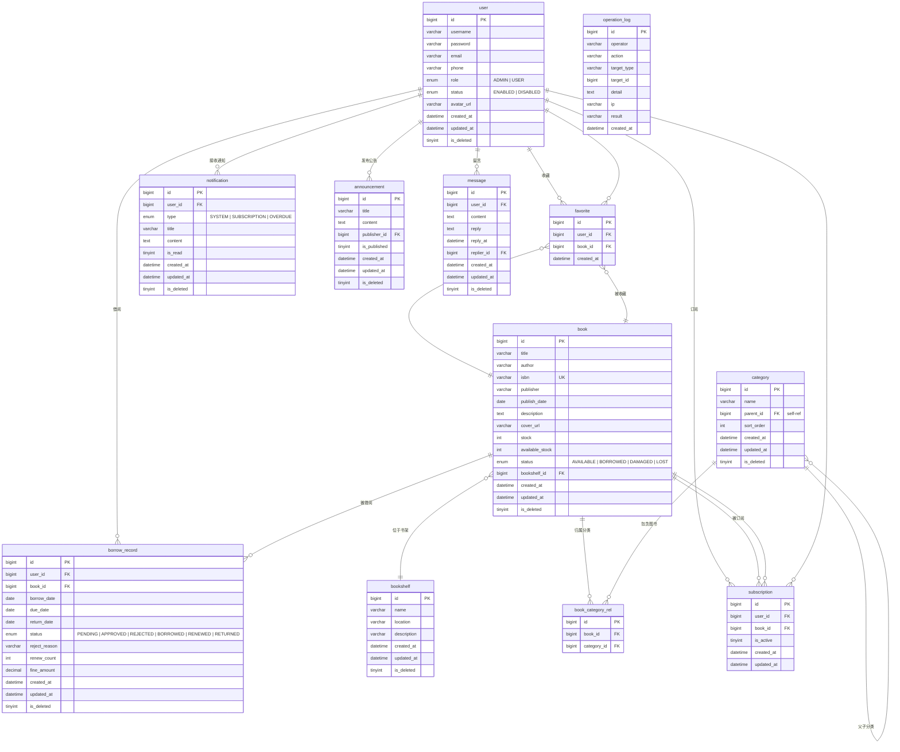

# BookNexus E-R 图

## 实体关系说明

| 关系 | 类型 | 说明 |
|------|------|------|
| user → borrow_record | **1:N** | 一个用户可拥有多条借阅记录 |
| user → favorite | **1:N** | 一个用户可收藏多本图书（user_id + book_id 联合唯一） |
| user → notification | **1:N** | 一个用户可接收多条通知（逾期/订阅/系统） |
| user → subscription | **1:N** | 一个用户可订阅多本图书（user_id + book_id 联合唯一） |
| user → message | **1:N** | 一个用户可提交多条留言 |
| user → announcement | **1:N** | 一个管理员可发布多条公告（publisher_id → user.id） |
| book → borrow_record | **1:N** | 一本书可被多次借阅 |
| book → favorite | **1:N** | 一本书可被多个用户收藏 |
| book → subscription | **1:N** | 一本书可被多个用户订阅 |
| book → bookshelf | **N:1** | 多本书可位于同一书架 |
| book → book_category_rel | **1:N** | 一本书可属于多个分类（M:N 中间表） |
| category → book_category_rel | **1:N** | 一个分类可包含多本图书 |
| category → category | **1:N** | 分类自引用树形结构（parent_id） |

### 关键设计点

1. **软删除**：除 `favorite`、`subscription`、`operation_log`、`book_category_rel` 外，其余表均采用 `is_deleted` 逻辑删除。
2. **联合唯一索引**：`favorite(user_id, book_id)` 和 `subscription(user_id, book_id)` 防止重复收藏/订阅。
3. **分类树**：`category` 通过 `parent_id` 自引用实现无限级树形分类。
4. **借阅状态机**：`borrow_record.status` 流转路径为 PENDING → APPROVED → BORROWED → (RENEWED → BORROWED) → RETURNED，或 PENDING → REJECTED。
5. **审计字段**：所有业务表均包含 `created_at`、`updated_at`，逻辑删除表额外包含 `is_deleted`。`operation_log` 仅记录操作时间无更新需求，故仅有 `created_at`。
